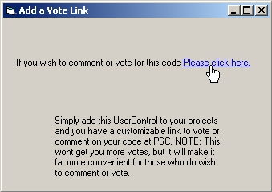



## Add a PSC vote link to your projects

### Description

The purpose of this UserControl is to simply allow you to place a vote/comment link on your projects that you submit to PSC. Just add this UserControl to any of your projects and configure the link propities to suit before uploading your project. This wont get you more votes, but it will make it far more convenient for those who do vote. The way this works is by locating the @PSC_ReadMe.txt file that is automaticly added to all projects at PSC. Then finding the url within this file and linking to it. This code is will commented and should be easy to understand for beginers.
 
### More Info
 

             |
---                |---
**Submitted On**   |2006-07-26 02:46:08
**By**             |[Jason Curtius](https://github.com/Planet-Source-Code/PSCIndex/blob/master/ByAuthor/jason-curtius.md)
**Level**          |Beginner
**User Rating**    |5.0 (10 globes from 2 users)
**Compatibility**  |VB 6\.0
**Category**       |[Miscellaneous](https://github.com/Planet-Source-Code/PSCIndex/blob/master/ByCategory/miscellaneous__1-1.md)
**World**          |[Visual Basic](https://github.com/Planet-Source-Code/PSCIndex/blob/master/ByWorld/visual-basic.md)
**Archive File**   |[Add\_a\_PSC\_2009947312006\.zip](https://github.com/Planet-Source-Code/jason-curtius-add-a-psc-vote-link-to-your-projects__1-66134/archive/master.zip)

